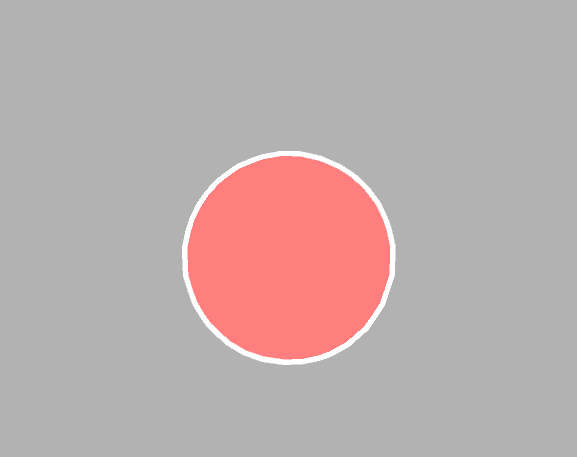
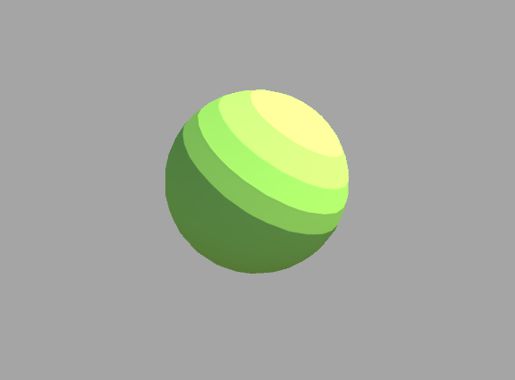

A repository to keep shader related stuff.
--------

Transparent Shader
--------

Outline Shader
--------

Cel Shading
--------

Resources:
--------

Alan Zucconi:  
http://www.alanzucconi.com/2015/06/10/a-gentle-introduction-to-shaders-in-unity3d/  

Making Stuff Look Good With Unity:  
https://www.youtube.com/channel/UCEklP9iLcpExB8vp_fWQseg  

Unity Live Training:  
https://unity3d.com/learn/tutorials/topics/graphics/session-introduction?playlist=17102  
